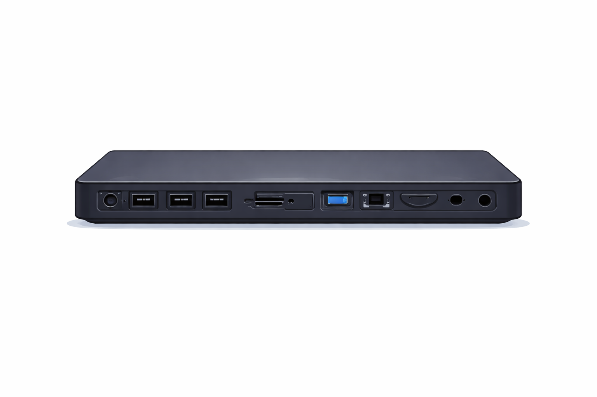

# General Troubleshoot and User assist

## Help Desk Tip
### Service-Now 
- Service-Now is ticket based program that a lot of big company uses. 
- Most of them are modifying it's settings, so will be explaining common level. 
- Depending on L1, L2, L3, there are requests coming in. Also by what tasks engineers do. 
- Typically has requests and incidents as large section, then user can check what kind of issues. 
- L1 usually manages simple tasks to check basic hardwares, password reset, helping user to use programs.
- L2 manages something that needs configuration, MS365 related, and Bitlocker. 
- L3 does not get ticket often, they tend to manage policies and design how system will be supported. 

### Password Security
- Some of compnaies use accounts that are shared with people which is not safe since their password is shared.
- Websites like Bitwarden is good way to use, admin can manage who can view password for which account.
- Only certain accounts can view certain password, so it's managed centrally and safely. 

## Inventory List
- For inventory/asset list, most IT support confuses when they have to build for new. 
- If you are L1, other engineer will give to you to fill it up or edit it but I can give few things to write down if you do yourself.
1. Categorize it. For example, laptop, desktop, mouse, keyboard.
2. Add serial number, model name, date of purchase, status(New, fairly good, usable, bad, no longer fixable)
3. Location like who are using it or where is it stored. 
4. If it's offering warranty, also put when warranty ends. 

## Korean Bank Issues
### User couldn't access web pages after logging in with bank ID
- This typically happens due to their security program is required and very old.
- Some of them even from early 2000s usually they are from end of 2000s or early 2010s. 
- On this case user installed necessary programs only but still did not proceeded. 
- I installed all of optional programs and it worked. 
- Depending on Tenant's Defender/Intune, a lot of these programs are blocked. 
- Suggested to provide laptop that's not joining the intune to use specific programs only. 

### After installing, file crashes with any written words are odd
- It happens when default langugage is not the langauge same as what program uses. 
- This is the method to change system locale, which usually resolve issue. 

- Open windows menu then search run, then type intl.cpl

- On this section, click system locale change 

- Change system locale language to language that program uses the confirm it. 
- I wouldn't suggest to click on Unicode UTF-8 option because it does not support a lot of languages. 

## Hardware 
### Connecting to LAN (Docking)
- Back in the days, most laptops had LAN connect port not aymore. 
- These days there are no LAN connector so people tend to use docking station. 

- This allows user to connect LAN, USB, HDMI, DP and connect laptop/desktop with USB C. 

- Sometimes, company offers this monitor. It has docking implemented in monitor. 

- If there isn't need of docking, using LAN to C is good too. Also, this is used a lot for PXE boot. 

## Printer Related 
### User couldn't print black/white on Mac
- This issue appeared after updating MacOS that printer was disconnected. 
- Connected printer with Static IP address but after connecting, even though choosing black/white option for printing, still prints in color. 
- Driver didn't affect either because Fuji decided to use different way.
- On Add Printer from Mac's System Settings, if it's within same network as DocuCentre-V, it appears on default printer. 
- Connecting through here directly allows user to print black and white. 

### User requested accessing printer website based 
- User requested to access printer on webpage based. 
- With static IP that printer engineer set, entere that IP to browser (on top to put address just enter ip like 192.168.0.1) to access Printer page. 
- Make sure IP address is configured on Printer with static IP address.

