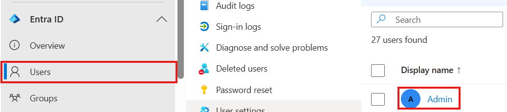
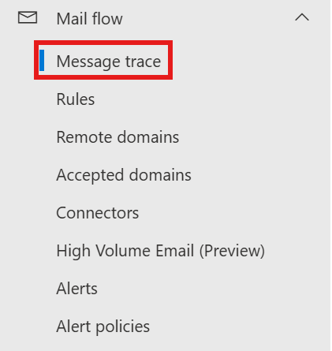

# Tasks Performed on Microsoft 365 Admin Centers

## Receiving Spam mail from different IP/Address constantly
- On our tenant a lot of users are receiving spam with same content but different address and IP.

- Go to Exchange admin center and "Add a rule."

- On Exchange center, click "Create new rule."

- Configure the condition, which are cause and result options, in this case it's quarantine. 

- This section is to include content of email, when other email has same content then it will be quarantined. 

## User had issue with logging in on Outlook
- Password of user was not wrong, but Authenticator caused error to not display passcode. 
- Issue is resolved by reregistaring through Entra ID. 

- Go to EntraID then go to user, click user that needs to reset MFA.

- On authentication methods section, there is re-register option on right top. It will require user to reregistar. 

## User requested bulk mail analysis
- User needed on Outlook to check mails that's related to certain topic and summarize them with it's content but it's bulk amount, like hundereds. 
- Accessing M365 program for data analysis, Copilot Business is great option since they can directly access program themselves. 

## User could't receive mails from specific address 
- User couldn't receive mails from specific address. Specifically after migration. 
- So, previous mail system they use caused problem. Internal mail routing bypassed external MX records due to overlapping mail systems.
- Due to that, it conflicts because previous and current mail has same addresses. 

- Where I checked if mail was within our Exchange server is checking MailFlow. 
- Then did trace to catch up. 

- Then on here trace start, it has options to find sender/receiver, time and contents, other option to trace. It did not appear which means it didn't arrive in Exchange in general. 

## User requested to create groups to receive mails together
- There is no group to receive email therefore users had to put email each by each to send to team.

- To create group, go to group on Exhcnage center, then click add a group. 

- Type of mail is depending on situation, on this case I chose M365 group incase needs of collaboration.

- Name on here will be used as name that user types on Exchange to search mail itself. 
- Then user does not need to enter email address, instead they just type name. 

- Choosing owner basically means for admin for this group. Can add or remove members  users from this group or manage some settings.
- By checking the account then clicking add, it will make that user to owner of the group.

- Same as owner, can add members from this page. 

- On email address name, it can be whichever needed and what comes after @ will be domain that tenant uses.
- Typically, it's opened as public so other users within same tenant can mail to this group.
- If they aren't in same tenant, they can't mail to the group. 
- If all of users within this group has license such as business standard, it also can be open as team within teams. 
- Once create, it will perform to accept mail as mail group. 

## User keep receiving confirmation of meeting room access 
- When creating resources, I set user as delegate to confirm meeting room use request. 
- User requested to take out the user from this. 

- After clicking meeting room resource, go to delegate settings. 

- Changed the resource mailbox setting to automatically accept or decline requests.

