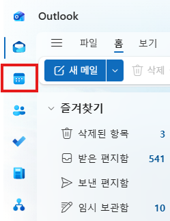
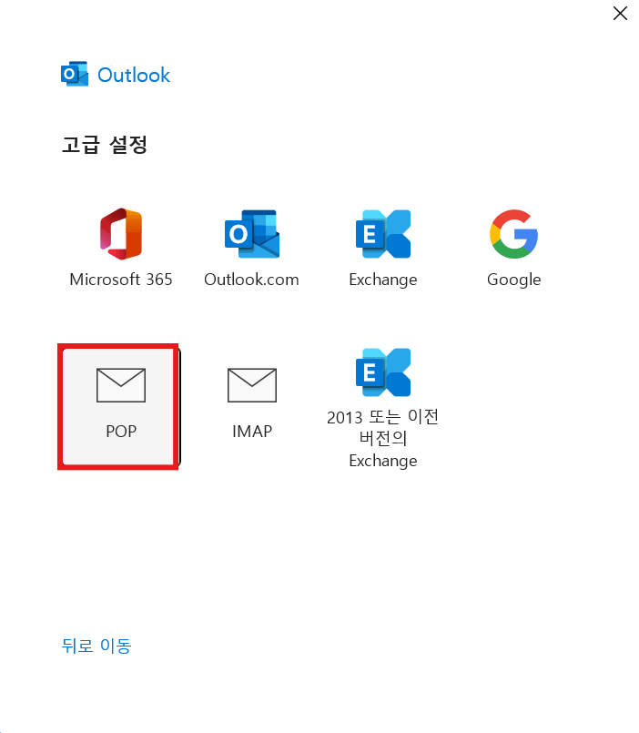

# M365 General Troubleshoot and assistance 

## User requested help on SharePoint use
- On this case it was user's first experience using SharePoint so guided user to understand it.

- On teams, click writing icon then click Create a team. Which lead user to create new team page. 

- On here, guided user that they can create a team but also can set as private team which isn't visible to others.
- Once user creates team here, it creates a site within Sharepoint. 
- It has General folder inside as default, adding a channel will add another folder by each channel. 
- Also can be viewed from SharePoint website. 

# Trouble Shootings of Outlook

## User couldn't view meeting rooms on Outlook Calender
- User couldn't view meeting rooms on Outlook

- On Outlook New, click Calender icon on the left. 

- Click Add Calender on the leftside. 

- Click add from directory then select account to search calender
- After selecting, there will be a section on the bottom to search meeting room then add. 

## Logging in with POP on Outlook
- POP login is different than typically Exchange based login. 

- Click setting up account manually.

- Click POP to login with POP.

- This page includes receive server, send server, port number, and encryption methods. 
- These informations are provided by mail services, typically on user's setting page.