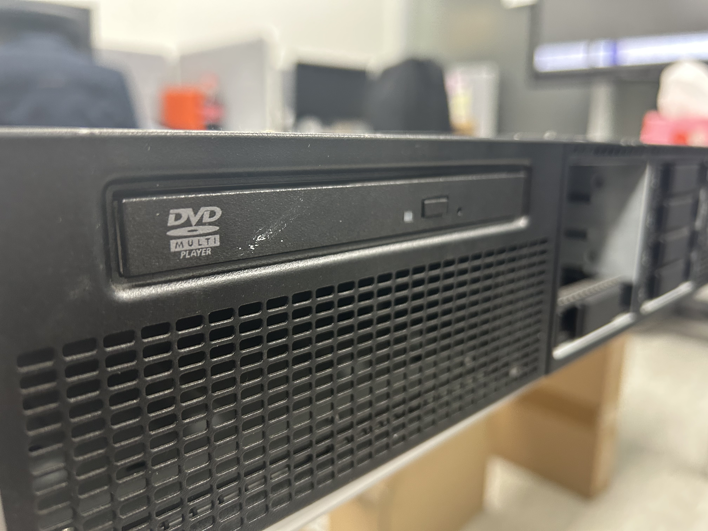
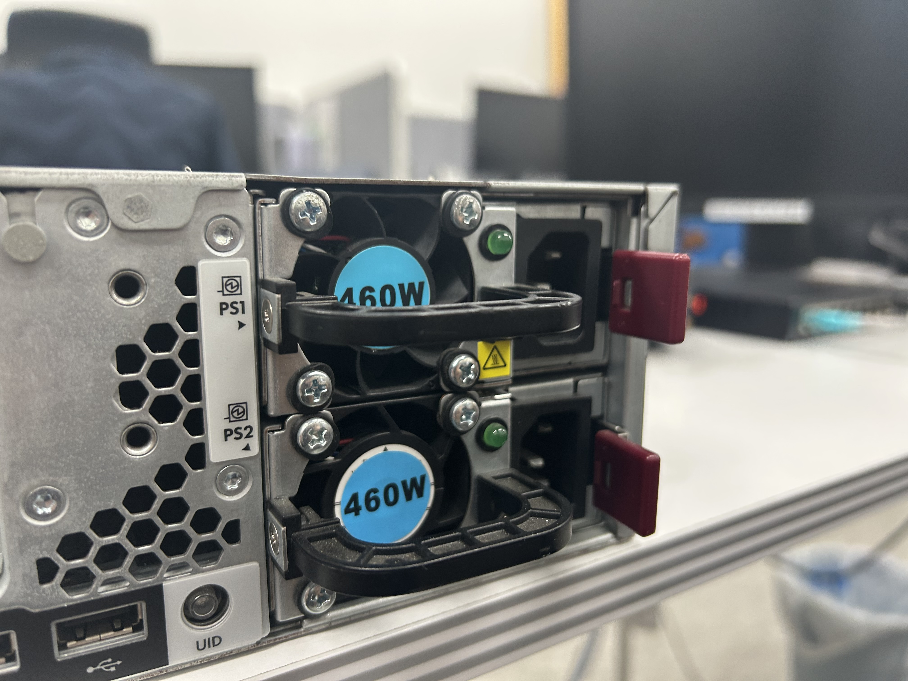
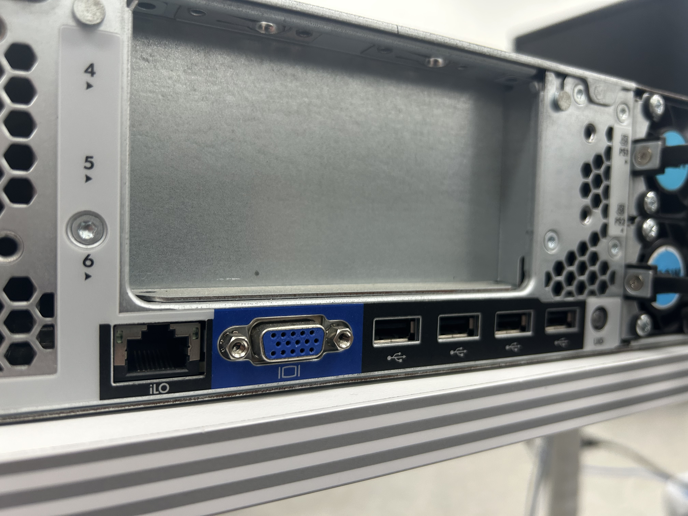

# Server Hardware 

## Basic Demontration
- For company that uses Active Directory usually has their server in server/network room. 
- Global company has their Server device on their headquarter or branch office too. 
- This page includes what's on the outside and inside, basic structure of it. 

## Server Outlook 

This is overall look of server, I will explain through front, back, middle(inside)

## Front - Hard Drive

At the front, there are slots for slide in hard drive. 
Pull this off put hard drive in then slide back it in again. 
Since there are multiple drives to manage, in most cases enginners set RAID to manage them.
Simple explanation of RAID is through software, combine drive storage and can seperate them as they need. 

## Front - DVD 

Sometimes, there are cases to use DVD drive. Some engineers use this to find which server is which.
Because when they go to the drive on server PC, it opens so it's easy to find. 

## Back - Power Ports

Server has two power ports and it can run with only one port too.
However, there is reason why ports are two and it's because if one outlet dies by some reason, 
other port should use different outlet to not shut sever down. 

## Back - LAN / Serial Port

LAN ports on the left has four of them. Just like power, it does not need to plug all four of them in. 
However, it's used for when one of them has failure, then it moves to next port to connect internet/network. 
On the right of LAN port, there is serial port. 
It's used for connecting to server to it's console without network. 

## Back - ILO

ILO port is the port to connect on PC to manage server through online web page. 
When you turn on the server, it displays IP address (It can be either from IPv4 or IPv6)
When you connected to ILO port then search that ip address on web, it will lead you to ILO page.
It allows to manage and view server information, depending on vender they even allow firmware update.
Firmware update file is on vendor's website. 
Other than that there are USB ports and port to connect and display port. 

## Opening the top

To open the top, there is usually something to unlock the top like this. 
After you unlock it, take of the top. 

## Device info

On the top there is info about the device, read it if it's needed. 

## Server Inside

This is what server looks like inside, it has various parts inside. 
I will break it down from as section seperate, from bottom to top. 

## FAN and Mainboard/Array Controller connection

What's on the right are fans to cool down sever. 
Check the blue cable(can be different color by vendor).

This cable will be connect to the Array controller and Mainboard. 
Array controller is the part that allows sever to use RAID

## Backplain power
 
This is where backplain power is at, backplain is the one accepts different disks to connect to server. 

## CPU and RAM

After you open the plastic case which is used for fans to cover CPU, there will be CPU and RAM.
CPU is the one on left and right, does not always need to use one. 
RAM has specific spots to put in depending on how many to use. 
Also, if you don't use one CPU, then you only use other side for putting in RAM

This is guide for implementing RAM, there are instruction to follow depending on how many. 

## PCI and Array Controller 

Getting back to this, it's okay to open PCIe and Array controller. 
PCIe is the one to connect Mainboard to other parts like Graphic cards to connect fast. 

This is raiser card that assist to PCIe to installed sideway, so it takes less space. 

## RAID Cache

This is RAID Cache, it saves RAID information temporarily in case server shuts down. 

This is RAID Cahce's power, it's at the front of Server. 

## Server Power 

This is sever power, it's on the left. 
This overall system is called system board. 